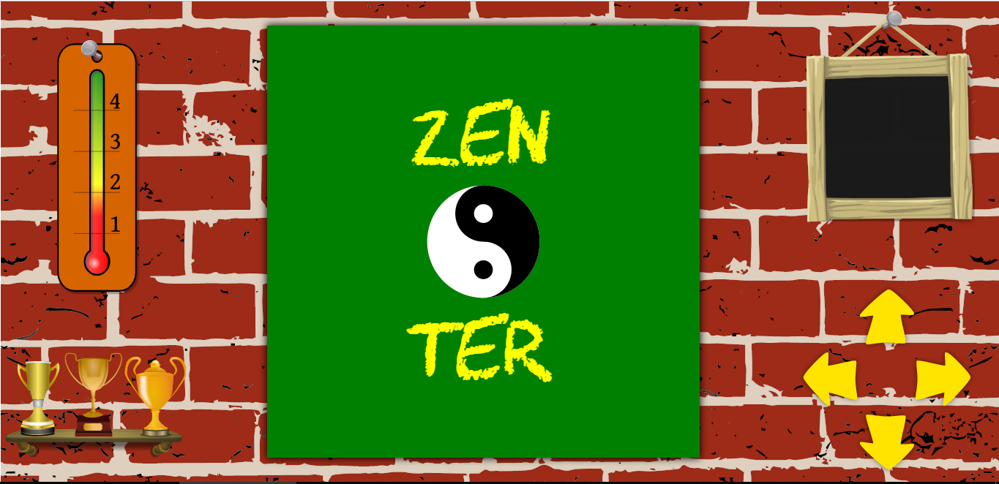
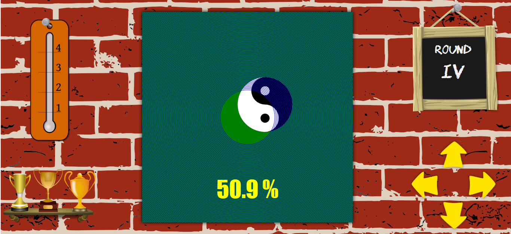
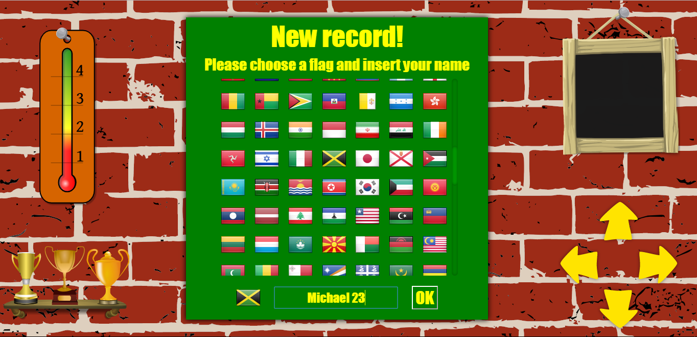

# Zenter

Zenter is a game where you have to put a circle in the **perfect center** of a green canvas.

 

  

 

You can move the circle by dragging it with the mouse pointer, your fingers, or with the yellow arrows buttons. If an arrow is clicked one time it moves the circle by just 1 pixel, but if it is kept pressed the movement speed will accelerate progressively.

A game is made of **5 rounds of 5 seconds** each, and at the end of every round you will see how good your percentage of centering was.

 

  

 

At the end of a game your average precision among the 5 rounds is calculated, and if your final result is very good you will be included in **Zenter's top ten!**

 

  

 

&nbsp;  

## Stack used:

**Frontend**: HTML Canvas, CSS, JavaScript

**Backend**: NodeJs, Express, MongoDB

&nbsp;

### Live at: https://www.micpob.com/zenter/

